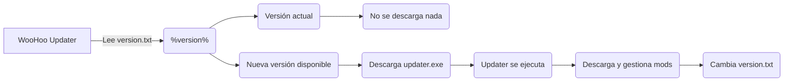

# WooHoo Updater

**Uso exclusivo de Hotel Viciados**

> Si ya has jugado en la partida anteriormente, salta [aquí](https://github.com/Hotel-Viciados/WooHoo-Updater?tab=readme-ov-file#woohoo-updater--multiplayer)

# ¿Cómo funciona?

He intentado prepararlo todo para que sea lo más fácil posible, pero no todo es perfecto y tiene sus inconvenientes

## Cosas que tienes que tener en cuenta

 - Todo está libre de malware, pero no voy a gastar dinero en comprar un certificado de desarrollador, con lo cual puede ser que tengas inconvenientes con tu antivirus, he hecho todo lo posible para detenerlo sin tener que apagar el antivirus completamente
 - Se agregarán 8 excepciones al cortafuegos para Hamachi (4 de entrada y 4 de salida)
 - Se agregará una excepción en **Windows Defender** de la carpeta `%USERPROFILE%\Documents\Electronic Arts\` que sería donde se instalaría el **WooHoo Updater** sin firmar
 - Se mencionará por **Discord** a la gente que esté jugando en nuestra partida para que actualice los mods

# Tutorial de instalación

## **Requisitos previos**

> Sims 4 versión 1.108.349.1020
> 
> Todas las expansiones

## **Hamachi**

> Si ya tienes Hamachi, desinstala Hamachi
 - Descarga e instala [este Hamachi](https://secure.logmein.com/hamachi/ih1.asp?lang=es&c=dkqd0kbkkwav0qzxaz7jgzvlq4ec4ubrxdkqy11o)
> Se te incluirá en una red cuando sea posible

## **Fixer**

 1. Descarga "[hamachi_n_woohoo_fix.bat](https://github.com/Hotel-Viciados/WooHoo-Updater/blob/main/first_init/hamachi_n_woohoo_fix.bat)"
 2. Ejecuta `hamachi_n_woohoo_fix.bat` como administrador 🛡️
 3. Sigue los pasos para finalizar

## **WooHoo Updater + Multiplayer**

 1. Descarga la última versión desde el panel de [releases](https://github.com/Hotel-Viciados/WooHoo-Updater/releases) (abajo del todo selecciona `WooHoo_Installer_2.0.0.exe`)
 2. Ejecuta `WooHoo_Installer_2.0.0.exe`
 3. Sigue los pasos para finalizar y ejecuta `WooHoo Updater`
 4. **En la consola, lee atentamente todos los pasos, pues es muy importante para que no haya equivocaciones**

# Tutorial para tu Sim (solo para nuevos)

## Crear un Sim

> Esto es una partida de simulación real, tienes que hacerte lo más parecido/a posible, y con rasgos que se asemejen a los tuyos

 1. Abre **The Sims 4** en tu escritorio
 2. Selecciona `Start Offline`
 3. Crea una nueva partida, y crea a tu Sim
 4. Cuando hayas acabado, guarda tu Sim en la biblioteca
 5. Cierra Los Sims (sin guardar)

## Exportar tu Sim

 1. Ve a tu carpeta de `Documentos > Electronic Arts > Los Sims 4`
 2. Selecciona la carpeta `Tray` y comprímela
 3. Sube el archivo [aquí](https://form.jotform.com/242485937607064)

> Se procesará tu Sim cuando sea posible

# Créditos
Recursos utilizados en este repositorio

 - **Electronic Arts**, por su juego y por algunos logotipos
 - **pizzadoggo**, por su [banner](https://www.steamgriddb.com/grid/335142) en steamgriddb.com
 - **Jason Williford**, por la [fuente](https://dafontsfree.net/the-sims-sans-sc-bold-font-download.html) de letras de Los Sims
 - [**l-urk**](https://github.com/l-urk), por el [software](https://github.com/l-urk/Bat-To-Exe-Converter-64-Bit/releases) `BAT to EXE converter`
 - **solicus**, por el [software](https://installforge.net/) `InstallForge`
